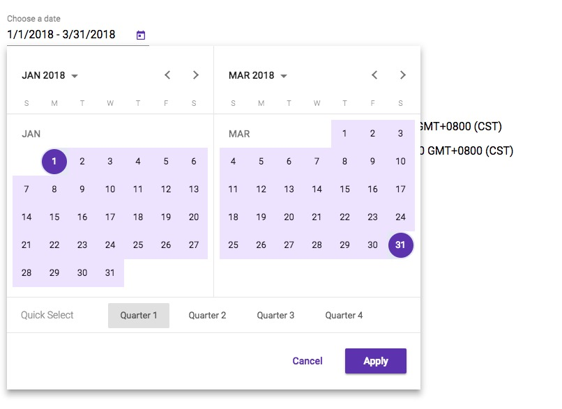

# Saturn datepicker
Material datepicker with range support
## What is this?

This is a based on Material source code (March 22, 2018) implementation of Material Datepicker for Angular.
I created this repository and this package due to it takes a lot of time to contribute to material2 repository.
[Issue in material2 repo.](https://github.com/angular/material2/issues/4763)


## Advantages
1) Dates range selecting in datepicker 
2) Have special attribute to turn on range mode on datepicker
3) Value managing as easy as it in `MatDatepicker`
4) *You can use all attributes: min, max, formControl and others*
5) Supports input from keyboard
6) Supports keyboard handling
 
## Disadvantages 
~~1) I use the same module and template names as it in native material datepicker. I do this, because I hope I'll push my code to material2 repository~~
2) Requires manual styles insertions
##Changelog

### 1.0
API has been completely changed.

## It's awesome, but how to use it?
As easy as pie.
Installation: `yarn add saturn-datepicker` or `npm install saturn-datepicker`
```angular2html
  <mat-form-field>
    <input matInput [saturnDatepicker]="resultPicker">
    <saturn-datepicker
        #resultPicker
        [rangeMode]="true">
    </saturn-datepicker>
   </mat-form-field>
```
Module name: `SaturnDatepickerModule`. Required also `MatDatepickerModule`.

And finally, add styles somewhere (for default pink theme):
```css

:not(.mat-calendar-body-disabled):hover > .mat-calendar-body-cell-content:not(.mat-calendar-body-selected):not(.mat-calendar-body-semi-selected),
.cdk-keyboard-focused .mat-calendar-body-active > .mat-calendar-body-cell-content:not(.mat-calendar-body-selected):not(.mat-calendar-body-semi-selected),
.cdk-program-focused .mat-calendar-body-active > .mat-calendar-body-cell-content:not(.mat-calendar-body-selected):not(.mat-calendar-body-semi-selected) {
  background-color: rgba(0, 0, 0, 0.04); }

:not(.mat-calendar-body-disabled):hover > .mat-calendar-body-semi-selected,
.cdk-keyboard-focused .mat-calendar-body-active > .mat-calendar-body-semi-selected,
.cdk-program-focused .mat-calendar-body-active > .mat-calendar-body-semi-selected {
  background-color: #3f51b5;
  color: white; }

.mat-calendar-body-selected {
  background-color: #3f51b5;
  color: white; }

.mat-calendar-body-begin-range:not(.mat-calendar-body-end-range) {
  border-radius: 100% 0 0 100%;
  background-color: #e8eaf6; }

.mat-calendar-body-end-range:not(.mat-calendar-body-begin-range) {
  border-radius: 0 100% 100% 0;
  background-color: #e8eaf6; }

.mat-calendar-body > tr .mat-calendar-cell-semi-selected ~ .mat-calendar-cell-semi-selected {
  border-radius: 0; }

.mat-calendar-cell-semi-selected {
  background-color: #e8eaf6; }
```

## I/O value have this interface:
```typescript
export interface SaturnDatepickerRangeValue<D> {
  begin: D | null;
  end: D | null;
}
```

## I found a bug what to do?
Create issue. But before, please be sure it happens due to range datepicker feature.


Licence: MIT

A little note for myself
```shell
npm run packagr
(cd dist ; npm pack)
yarn install range-0.0.1.tgz 
```
